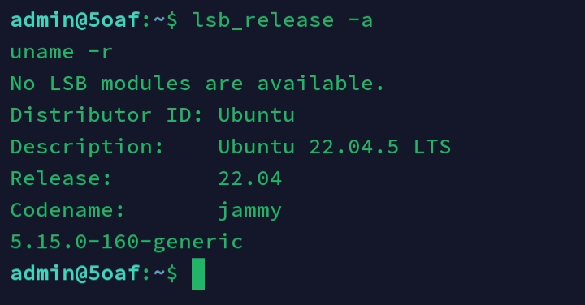
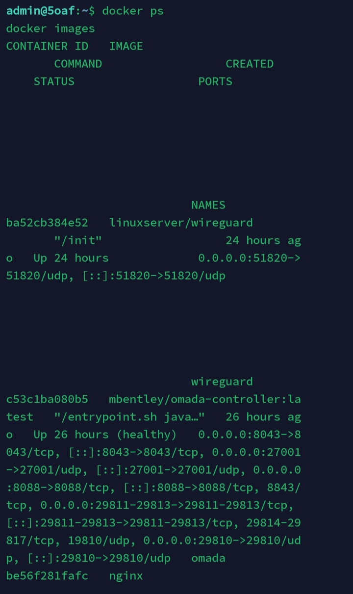
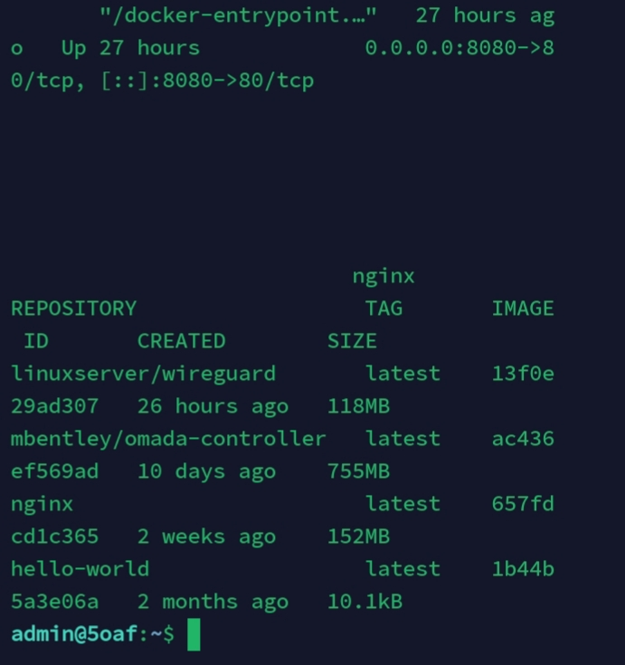
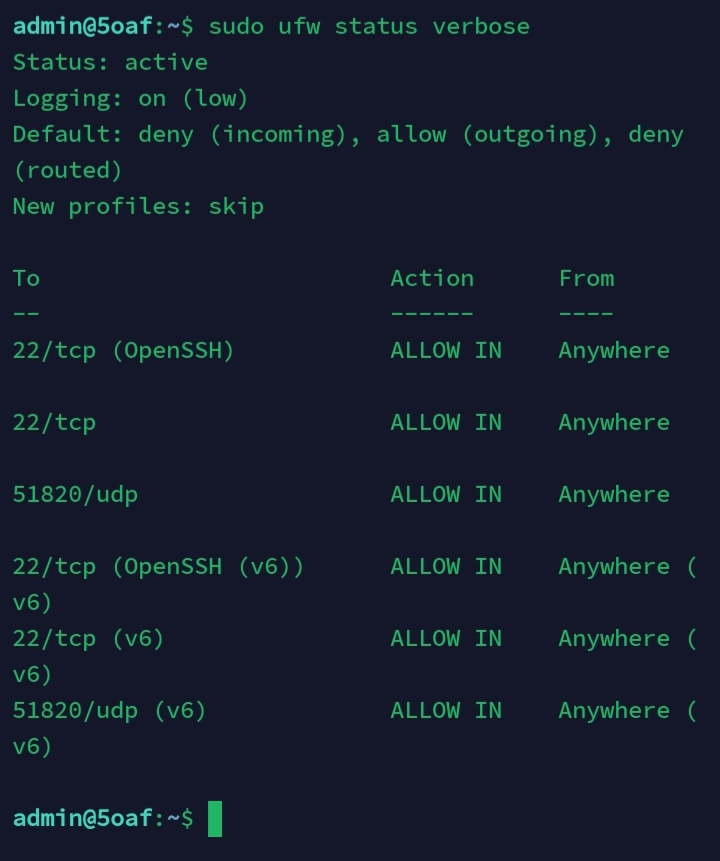
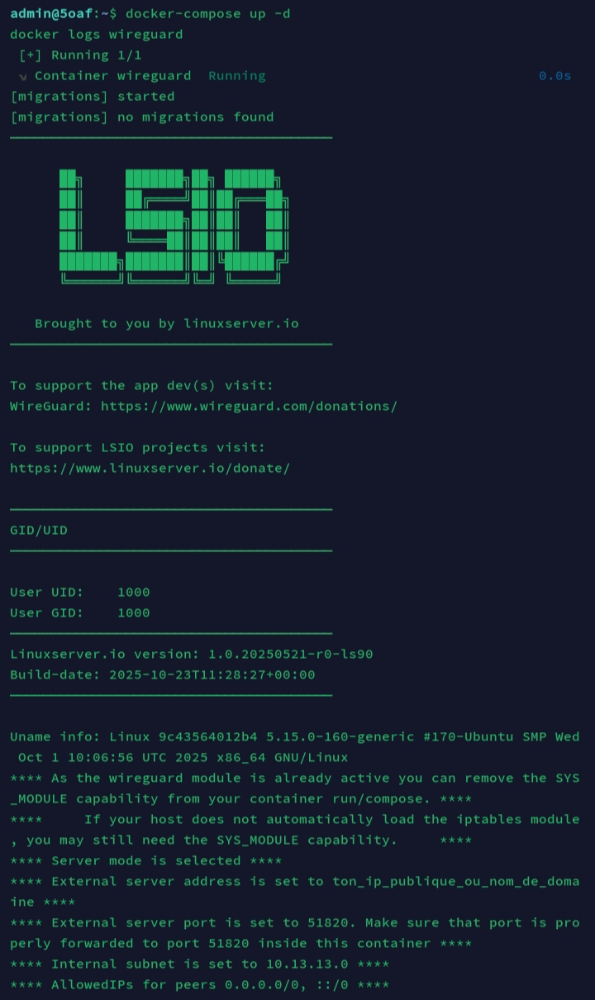
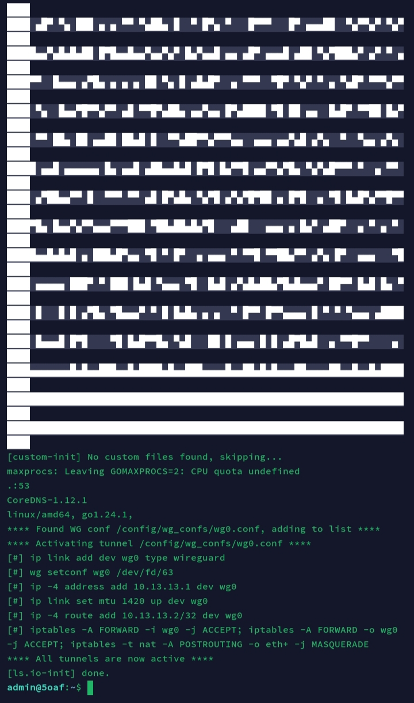
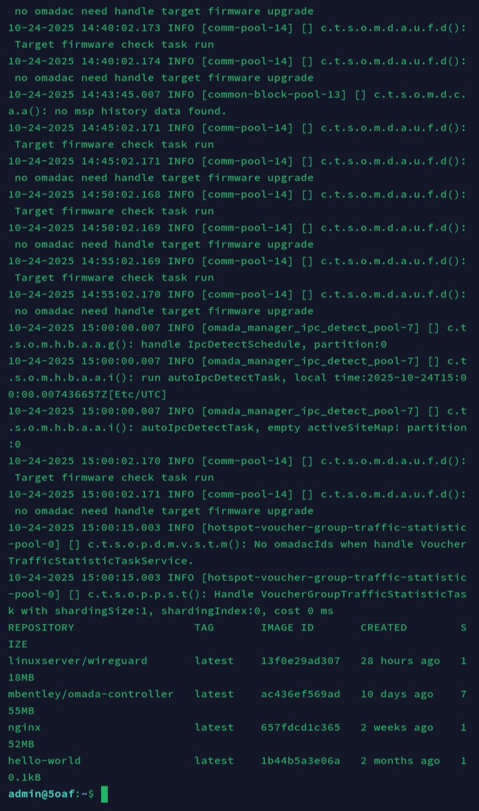

# Documentation du serveur VPS Ubuntu 22.04

Ce document décrit la mise en œuvre de mon serveur VPS, incluant la sécurisation, l’isolation des applications et la configuration des services.

---

## 1. Informations générales

- **Système d’exploitation** : Ubuntu 22.04 LTS
- **Utilisateur principal** : admin (avec droits sudo)
- **Objectif** : serveur sécurisé pour exécuter des conteneurs Docker et gérer des services comme Omada et WireGuard.

---

## 2. Vérification du système

Vérification de la version d’Ubuntu et du noyau Linux pour garantir la compatibilité et la sécurité.

```bash
lsb_release -a
uname -r
```

<p align=("center")>

</p>

## 3. Isolation des applications avec Docker

Toutes les applications sont exécutées dans des conteneurs Docker pour isoler le système principal et réduire les risques de compromission.

```bash
docker ps
docker images
```
<p align=("center"; "font-size:0";)>

</p>

## 4 . Vérification de la sécurisation du pare-feu et des services

```bash
sudo ufw status verbose
```
<p align=("center")>

</p>

## 5. Installation et configuration de WireGuard VPN

J’ai installé **WireGuard** pour créer un tunnel VPN sécurisé entre mon VPS et mes clients distants.  
Toutes les configurations sont faites.

```bash
docker-compose up -d
docker logs wireguard
```

<p align=("center")>

</p>

## 6 . Intégration avec Omada Controller

J'ai intégré mon serveur VPS avec **Omada Controller** pour centraliser la gestion de mon réseau TP-Link Omada. L'objectif est de vérifier que le service fonctionne correctement et que le conteneur est actif.

---

## 5.1 Vérification du conteneur Docker

```bash
# Vérifier que le conteneur Omada est actif
docker ps

# Vérifier les logs pour s'assurer que le service fonctionne
docker logs omada

# Vérifier les images Docker présentes
docker images
```

<p align=("center")>

</p>
