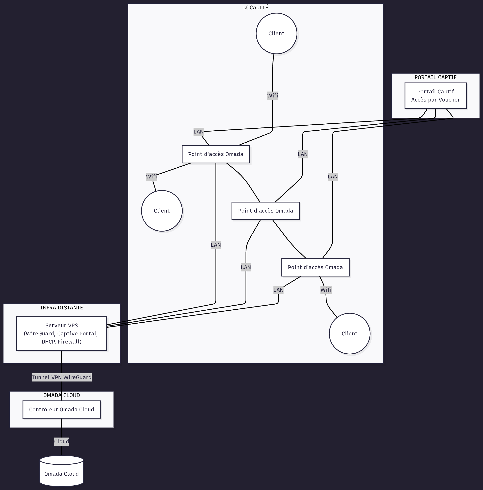

# omada-vps-network-project
Projet déployé : Réseau local + VPS + VPN + Portail Captif + Omada Cloud

En tant qu’ingénieur réseau, j’ai conçu et déployé une infrastructure complète et sécurisée pour desservir jusqu’à 40 clients dans une localité. Chaque utilisateur dispose d’un débit moyen de 1 Mbps en téléchargement et 600 Kbps en envoi, assurant une connexion stable et performante.

Le système repose sur un serveur VPS interconnecté à un contrôleur Omada Cloud via un tunnel VPN WireGuard, permettant une gestion centralisée, une supervision à distance et une configuration automatisée des points d’accès.
Un portail captif personnalisé permet aux utilisateurs de se connecter grâce à des codes uniques (vouchers), garantissant un contrôle rigoureux des accès et une sécurité renforcée.

Le projet est déjà déployé et opérationnel, et reste évolutif afin de s’adapter aux futurs besoins en couverture et en nombre d’abonnés.

